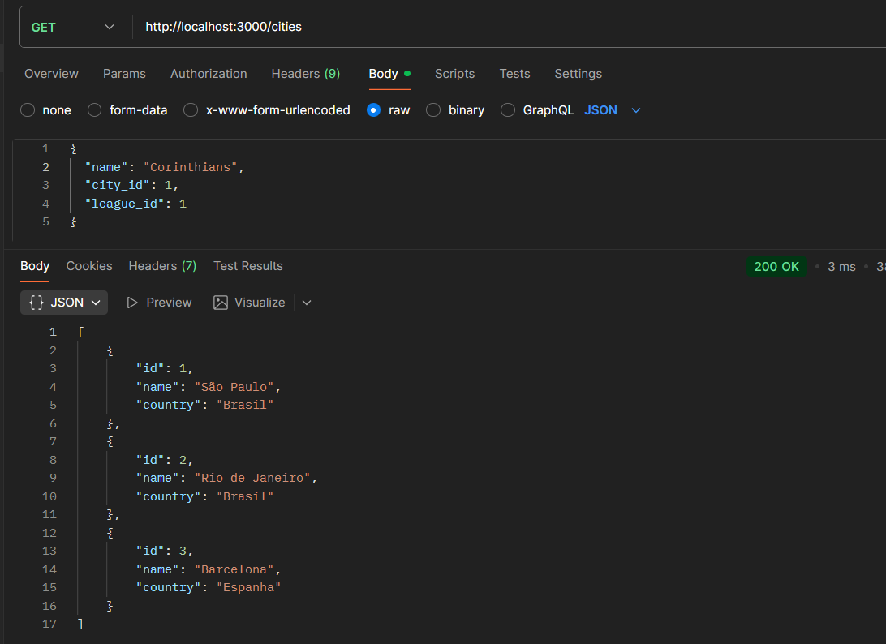
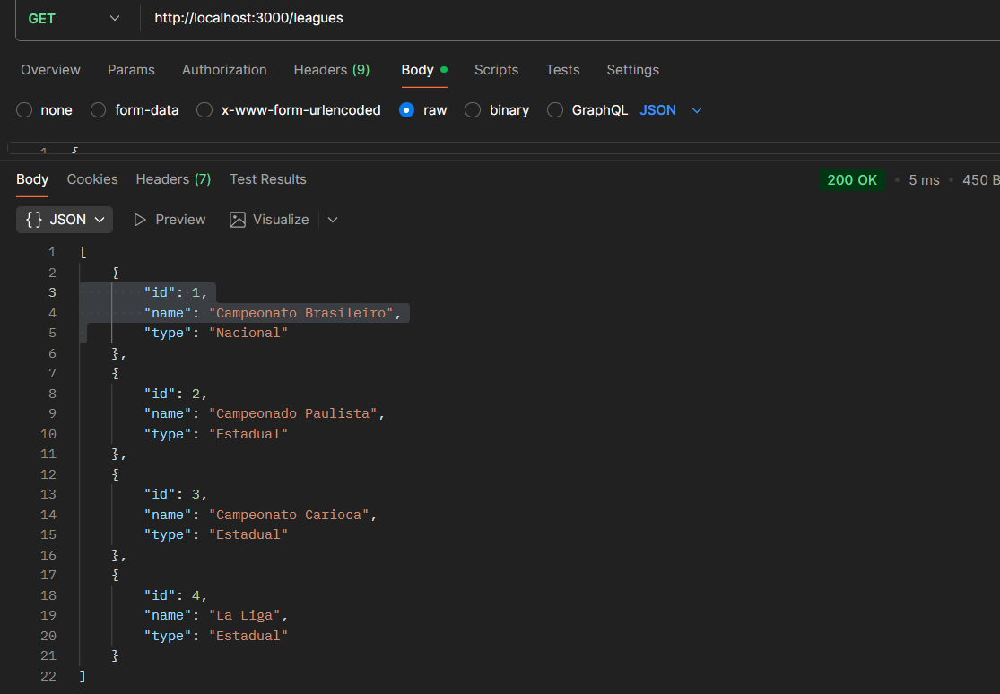
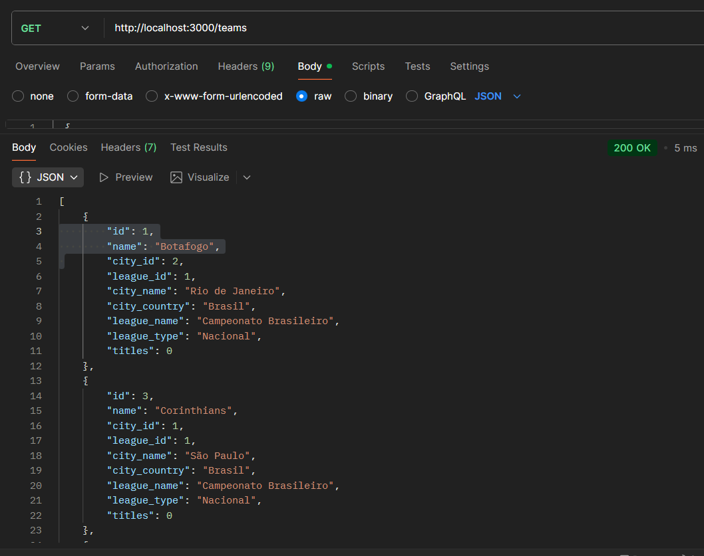
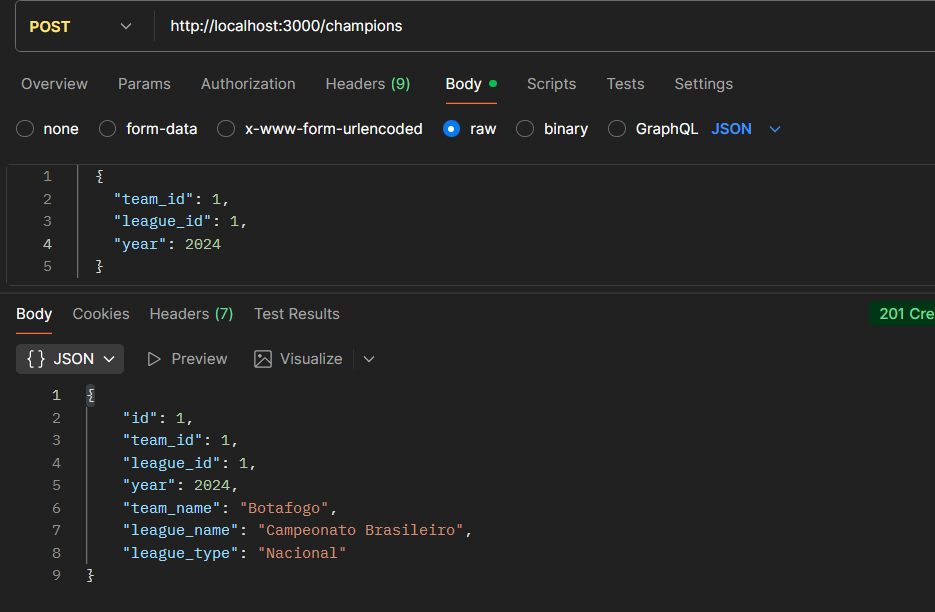

# API Endpoints

## Cities (Cidades)
- **POST** `/cities` - Create a new city
  ```json
  {
    "name": "São Paulo",
    "country": "Brasil"
  }
  ```
- **GET** `/cities` - Get all cities
- **GET** `/cities/:id` - Get a city by ID
- **PATCH** `/cities/:id` - Update a city
- **DELETE** `/cities/:id` - Delete a city




## Leagues (Ligas)
- **POST** `/leagues` - Create a new league
  ```json
  {
    "name": "Campeonato Brasileiro",
    "type": "Nacional"
  }
  ```
  Types: `Nacional`, `Estadual`, `Continental`, `Mundial`
- **GET** `/leagues` - Get all leagues
- **GET** `/leagues/:id` - Get a league by ID
- **PATCH** `/leagues/:id` - Update a league
- **DELETE** `/leagues/:id` - Delete a league




## Teams (Times)
- **POST** `/teams` - Create a new team
  ```json
  {
    "name": "Botafogo",
    "city_id": 1,
    "league_id": 1
  }
  ```
- **GET** `/teams` - Get all teams (includes city, league info and title count)
- **GET** `/teams/:id` - Get a team by ID
- **PATCH** `/teams/:id` - Update a team
- **DELETE** `/teams/:id` - Delete a team




## Champions (Campeões)
- **POST** `/champions` - Create a new championship record
  ```json
  {
    "team_id": 1,
    "league_id": 1,
    "year": 2023
  }
  ```
- **GET** `/champions` - Get all championship records (includes team and league info)
- **GET** `/champions/:id` - Get a championship record by ID
- **PATCH** `/champions/:id` - Update a championship record
- **DELETE** `/champions/:id` - Delete a championship record



## Database Schema

### cities
- id (INTEGER, PRIMARY KEY, AUTOINCREMENT)
- name (TEXT, NOT NULL)
- country (TEXT, NOT NULL)

### leagues
- id (INTEGER, PRIMARY KEY, AUTOINCREMENT)
- name (TEXT, NOT NULL)
- type (TEXT, NOT NULL) - CHECK: Nacional, Estadual, Continental, Mundial

### teams
- id (INTEGER, PRIMARY KEY, AUTOINCREMENT)
- name (TEXT, NOT NULL)
- city_id (INTEGER, FOREIGN KEY -> cities.id)
- league_id (INTEGER, FOREIGN KEY -> leagues.id)

### champions
- id (INTEGER, PRIMARY KEY, AUTOINCREMENT)
- team_id (INTEGER, FOREIGN KEY -> teams.id)
- league_id (INTEGER, FOREIGN KEY -> leagues.id)
- year (INTEGER, NOT NULL)

